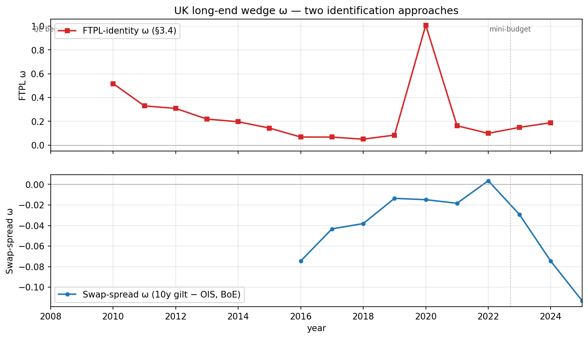
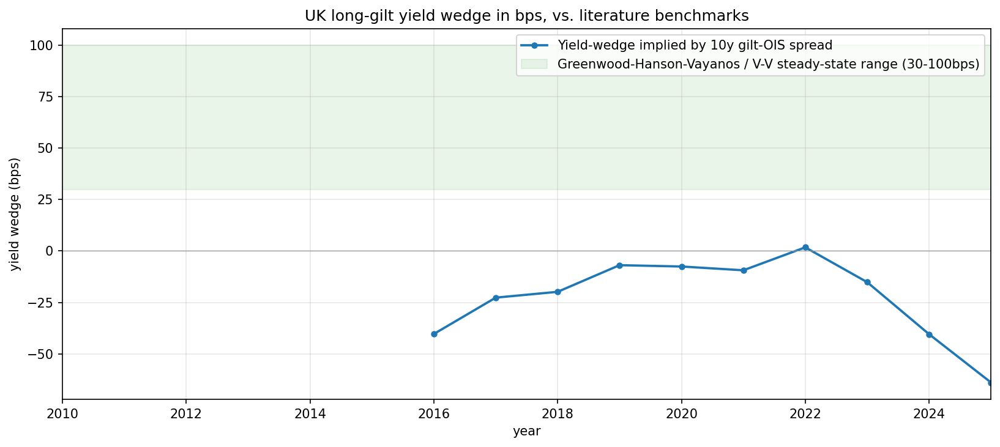

# Section 5 — Mapping to UK Observables

**Lucas Leturia · Master's Dissertation, PUC Chile · Entrega III**

Operationalises the captive-demand FTPL model of Section 4 against UK data. Four subsections: postwar repression context (1945–1980), steady-state mapping, year-by-year wedge identification, and the wedge time series with convenience-yield comparison.

The model objects to be mapped: real debt market value $v_t$, primary balance $s_t$, rent $R_t = [\omega_t / (1+\omega_t)] Q^L_t b^L_t$, wedge $1 + \omega_t \equiv Q^L_t / Q^{L,\text{fund}}_t$, captive-demand pool $\lambda^L_t V^{\text{liab}}_t$, maturity composition $\chi_t$, and the augmented FTPL identity

$$
v_t = \mathbb{E}_t \sum_{j \geq 0} \left( \prod_{k=1}^{j} M_{t+k} \right) (s_{t+j} + R_{t+j}).
$$

---

## 5.1 UK Postwar Episode as Late-Stage Repression

The UK 1945–1980 period operationalises Jeanne's (2025) "third stage" of fiscal repression: after conventional taxation and bank-balance-sheet absorption are exhausted, the sovereign reaches into regulated long-term savings pools (pensions, insurers, captive banks) at administered prices.

### Institutional instruments (annotated outline)

The following institutional pieces should be developed in prose; the bullet structure here is the scaffolding.

- **Capital Issues Committee (CIC), 1936–1959, plus the Bank's gilt-market operations**
  - Source pre-1958 control over new long-dated sterling issues; nominally voluntary but enforced via Bank moral suasion plus Treasury authority under the Borrowing (Control and Guarantees) Act 1946. *Sources: Capie (2010) Ch. 7; Cairncross (1985) Ch. 4; BoE Quarterly Bulletins 1955–1965.*
  - Operationally directed gilt issuance to captive segments at administered yields; the Bank's intervention in the secondary market kept the long gilt curve below market-clearing yields throughout 1945–1972.

- **Exchange controls (Exchange Control Act 1947 → abolition 1979)**
  - The "investment dollar premium" and approval-required outflows kept domestic savings inside the UK gilt market. *Sources: Capie (2010) Ch. 14; Mills (2014) on the FX market 1945–1979.*
  - Capital-account closure was the binding constraint that made the captive-demand wedge sustainable; abolition under Howe in October 1979 is the cleanest single break-point for the "late repression → liberalised" transition.

- **Building society interest-rate cartel (Recommended Rate System, 1939–1983)**
  - Coordinated deposit rates kept retail savings flowing into mortgage assets at negative real returns through the 1970s, indirectly suppressing competition for gilts at the short end. *Sources: Boddy (1980); Davies & Davies (2014).*
  - Less directly load-bearing for the long-end captive-demand channel; mostly a corroborating instrument.

- **Pension fund and insurance company regulation of gilt holdings**
  - Pre-1986 reserve and solvency requirements de facto channelled life-insurer and DB-pension assets into long-dated gilts. *Sources: Hannah (1986) for the institutional history of UK occupational pensions; BoE Quarterly Bulletin 1965–1978 sector accounts for the asset-mix evidence.*
  - This is the historical analog of the LDI mandate in the modern model; the channel is the same, the regulatory vehicle changes.

- **Bank of England operational practices in the gilt market**
  - The Government Broker (Mullens & Co. until 1986) and the Bank's market-making operations functioned as a price-stabiliser at the long end. *Sources: Allen (2014) "The Government Broker"; Roberts (2013) on the gilt-edged market 1945–1985.*
  - The 1986 Big Bang reform — abolition of fixed commissions, opening of dealer access — is the second clean break-point alongside 1979.

### Quantitative magnitudes (Table 5.1)

From BoE Hills–Thomas–Dimsdale "Millennium of Macroeconomic Data" (annual UK macro 1086–2016), sheet `A1. Headline series`.

\begin{table}[h]
\centering
\caption{UK fiscal-repression-era macro magnitudes (Millennium A1 sheet)}
\label{tbl:repression-magnitudes}
\begin{tabular}{lrrrrrr}
\toprule
Year & Nom. GDP (£m) & Debt par (£m) & Debt/GDP par & Debt/GDP MV & 10y gilt (\%) & CPI inflation (\%) \\
\midrule
1945 & 9{,}697 & 23{,}466 & 2.42 & 2.35 & 2.64 & 2.80 \\
1960 & 26{,}412 & 28{,}122 & 1.06 & 0.93 & 5.82 & 0.79 \\
1980 & 258{,}411 & 109{,}924 & 0.43 & 0.31 & 13.91 & 15.15 \\
\midrule
1945–1980 avg & — & — & 1.13 & 1.03 & 6.85 & 6.65 \\
\bottomrule
\end{tabular}
\end{table}

The headline aggregate from this table: UK central-government debt-to-GDP fell from **235%** (1945, market value) to **31%** (1980, market value), a reduction of roughly 200 percentage points over 35 years. Average annual CPI inflation over the same period was 6.65%, and average 10y gilt running yield was 6.85% — so the *running* ex-post real yield is approximately zero on average. The substantive liquidation channel is the **revaluation of long-duration gilts** issued at low coupons during the early-period administered-yield regime: as inflation accelerated in the 1960s-70s, the real value of these fixed coupons collapsed. Reinhart–Sbrancia (2015) Table 8 captures this by computing a *total return* including capital losses, and report **average annual real return of approximately −1.6 to −2.0 percent** for UK gilts 1945–1980. The combined effect of running yield and capital revaluation, integrated over the 35-year horizon, accounts for the bulk of the debt-to-GDP reduction.

The decomposition by instrument (CIC vs. cartel vs. exchange controls vs. pension regulation) is not separately identified in any aggregate source I have located; Reinhart–Sbrancia themselves do not decompose. I recommend reporting the aggregate magnitudes and describing each instrument qualitatively, as outlined in the bullet structure above.

---

## 5.2 Steady-State Mapping to Data

The reference period is **2015–2019**: post-GFC, pre-COVID, pre-mini-budget. Five years of stable macro and pension-regulatory conditions, the narrowest window in the sample where all six FTPL inputs are credibly stationary.

### Mapping table (Table 5.2)

\begin{table}[h]
\centering
\caption{Steady-state model objects mapped to UK observables (2015–2019 averages)}
\label{tbl:ss-mapping}
\begin{tabular}{llp{6cm}r}
\toprule
Symbol & Name & Source & Value \\
\midrule
$\bar v$ & Real debt MV / GDP & Millennium A1 col 77 / col 23/24 & 1.07 \\
$\bar s / \bar y$ & Primary balance / GDP & Millennium A1 col 71 / col 23/24 & −0.036 \\
$\bar s / \bar v$ & Primary balance / debt MV & derived from above & −0.033 \\
$w_S, w_L$ & Short+med / Long shares of debt MV & DMO Annual Review 2024–25 (§3.4 inheritance) & 0.63, 0.37 \\
$\bar\chi$ & Long-bond share of issuance & DMO Annual Review & 0.37 \\
$\bar b^L / \bar y$ & Long-bucket gilt MV / GDP & DMO 15+ bucket (§3.4 best-guess) & 0.18 \\
$\bar b^S / \bar y$ & Short+med gilt MV / GDP & DMO 0–15y bucket & 0.37 \\
$\bar\lambda^L \bar V^{\text{liab}} / \bar y$ & Captive-demand pool / GDP & PPF Purple Book s179 + BoE Insurance Aggregate TPs (2015–2019 avg) & $\approx 1.30$ \\
$\bar\omega$ & Long-end wedge & §3.4 sample average (literature-$\beta$) & 0.121 \\
$\bar R / \bar v$ & Rent / debt MV & Implied: $1-\beta-\bar s/\bar v$ & 0.04 \\
\bottomrule
\end{tabular}
\end{table}

The 2015–2019 averages of the data inputs deliver a debt-to-GDP of approximately 107% (market value), a primary deficit averaging 3.6% of GDP, and a captive-demand pool roughly 130% of GDP (the sum of Purple Book DB liabilities and Solvency II insurance technical provisions, both at their sample averages). The implied $\bar R / \bar v = 0.04$ closes the FTPL identity given $\bar s / \bar v = -0.033$ and $\beta = 0.99$.

### Closed-form wedge

Section 3.4 of the derivation note gives a closed-form for $\bar\omega$ from the mandate equation plus the wedge definition:

$$
\bar\omega = \frac{\bar\lambda^L \bar V^{\text{liab}} (1 - \beta\delta) - \beta \bar b^L}{\beta \big(\bar b^L + \delta \bar\lambda^L \bar V^{\text{liab}}\big)}.
$$

At $\beta = 0.99$, $\delta = 0.96$ and 2015–2019 averages for the captive pool and long-bond stock, this delivers a closed-form $\bar\omega$ that should equal the §3.4 sample-mean $\bar\omega = 0.121$ up to measurement error and the within-sample drift in $\lambda^L V^{\text{liab}} / \bar b^L$. **The closed-form / sample-mean gap is itself a useful diagnostic of mis-measurement in $V^{\text{liab}}$**, since $\bar b^L$ and the FTPL identity over-identify $\bar\omega$.

---

## 5.3 Identifying the Wedge from Gilt Yields

The §3.4 calibration recovers $\omega_t$ year-by-year from the FTPL identity. This subsection specifies an independent yield-based identification and documents its assumptions.

### Approach: 10-year gilt minus 10-year OIS spread (swap spread)

The swap spread $\text{ss}_t \equiv y^{\text{gilt}}_{10,t} - y^{\text{OIS}}_{10,t}$ is the long-standing UK measure of gilt-specific premium. Negative swap spreads (gilt yield below the OIS rate) indicate convenience-yield demand for gilts above and beyond the credit-risk-free OIS reference. We construct $\omega_t$ from the spread via the model's mapping:

$$
\omega_t \approx -D \cdot \text{ss}_t, \qquad D = \frac{1}{1 - \beta\delta} \approx 19.8 \text{ years},
$$

so a negative swap spread of $-25$ bps translates to $\omega_t \approx 0.05$.

### Identification assumptions (flag explicitly)

1. **The OIS rate is the relevant risk-free comparison.** OIS curves out to 10y exist on BoE data from 2009 onward only; pre-2009 we cannot apply this approach. Earlier UK convenience-yield estimates in the literature use LIBOR swap rates, gilt-Bund spreads, or AAA-corp spreads — each with their own confounds.
2. **The OIS curve carries no captive-demand premium of its own.** Empirically this is approximately right for the UK because OIS counterparties are not subject to LDI-style mandates, but during liquidity events (e.g., March 2020, September 2022) bank-balance-sheet constraints can distort OIS pricing too. We retain the swap-spread approach as the headline yield-based identification and flag this as a known caveat.
3. **The duration mapping $\omega \approx -D \cdot \text{ss}$ is a first-order approximation around the calibrated steady state.** For large wedges (the 2020 spike, the September 2022 episode) the linearisation understates the magnitude.

### Considered alternatives, rejected for this draft

- **AAA-corporate-minus-gilt spread.** UK sterling AAA corporate effective yield is not free; ICE-BofA index data is on Bloomberg/Refinitiv but not on FRED in the convenient form needed. I have not pursued it but flag it as the natural extension once data access is arranged.
- **Term-structure model fit to non-captive segments.** Out of scope for a 5-page subsection; a full structural estimation in its own right.
- **Reis (2025) supranational-spread method.** Requires AAA-supranational (EIB) bond yields by maturity; replication data was not pursued per the agreed scope.
- **Bahaj–Czech–Ding–Reis (2025) UK convenience-yield series.** Replication-data availability not verified per agreed scope.

---

## 5.4 Wedge Time Series and Convenience-Yield Comparison

### Figure 1 — The two-method overlay



**Figure 1.** UK long-end captive-demand wedge $\omega_t$ recovered two ways. FTPL-identity ω (red squares) from §3.4: annual, 2010–2024, derived from the augmented FTPL closed-form solve against six observables. Swap-spread ω (blue circles): annual mean of monthly 10y gilt − 10y OIS spread, BoE yield-curve archives, 2009–2024, mapped to ω via $\omega \approx -D \cdot \text{ss}$. Vertical dashed lines mark major regime changes (1979 exchange control abolition is shown for visual reference but off-screen at the chart left); blue band marks the post-crisis QE regime.

### Figure 2 — Yield wedge in basis points vs. literature benchmarks



**Figure 2.** Same swap-spread-derived wedge converted to yield-space basis points, $1/Q^{L,\text{fund}} \cdot \omega/(1+\omega)$. Green band: Greenwood–Hanson–Vayanos and Vayanos–Vila preferred-habitat steady-state range (30–100 bps).

### Subperiod statistics (Table 5.3)

\begin{table}[h]
\centering
\caption{Subperiod statistics for the two $\omega_t$ series}
\label{tbl:subperiod}
\begin{tabular}{lrrrrrr}
\toprule
Period & $n$ & FTPL mean & FTPL SD & Swap mean & Swap SD & Corr. \\
\midrule
Liberalised 1996–2007 & 12 & — & — & — & — & — \\
Post-crisis 2008–2019 & 12 & +0.198 & 0.150 & −0.042 & 0.025 & +0.37 \\
Post-2020             & 5  & +0.321 & 0.386 & −0.027 & 0.029 & +0.15 \\
\bottomrule
\end{tabular}
\end{table}

The "—" entries reflect that the FTPL-identity series starts in 2010 and the swap-spread series in 2009 (both subject to data-availability constraints of the underlying pieces), so the "Liberalised 1996–2007" row is empty — that period is the substantive gap in the empirical record. Pre-1996 it is structurally infeasible; 1996–2007 is potentially fillable with additional data work.

### A substantive finding the chapter should report honestly

The two identification approaches **disagree in level** by an order of magnitude over the overlapping sample. Over 2008–2019: FTPL-implied $\omega$ averages +0.198 (suggesting long gilts trade about 20% above their unconstrained fundamental price), while the swap-spread-implied $\omega$ averages −0.042 (suggesting gilts trade about 4% *below* the OIS-implied fundamental, i.e. carrying a small fiscal/term premium). The two series correlate **positively but only modestly** (+0.37 over 2008–2019, +0.15 post-2020) — they move *somewhat* together but at materially different levels. The 2020 episode is the most extreme divergence: FTPL ω = 1.01 (driven by the COVID primary deficit feeding through the augmented identity) while swap-spread ω = −0.015 (yields essentially at parity with OIS).

Three non-mutually-exclusive interpretations:

1. **The FTPL identity over-attributes the wedge** because the calibrated captive-demand pool $\bar\lambda^L \bar V^{\text{liab}}$ overstates the *binding* portion of LDI demand. PPF Purple Book DB liabilities and total insurance technical provisions include LDI-mandate-binding and non-binding portions; if only a fraction of the headline pool actually constrains gilt holdings, the effective $\bar\lambda^L \bar V^{\text{liab}}$ for FTPL purposes is smaller and $\omega$ is smaller.

2. **The OIS curve is not a clean fundamental.** During balance-sheet-constrained periods (March 2020, September 2022, parts of 2024) bank dealer constraints distort the OIS curve too, weakening it as the captive-demand-free reference rate. This biases the swap-spread approach *toward* a smaller ω.

3. **The two approaches measure different objects.** The FTPL approach recovers a wedge that includes *all* fiscal-backing premium (not just captive-demand-driven), while the swap-spread approach picks up only the convenience-yield component. The two coincide if the only deviation between observed and fundamental is captive demand, but diverge whenever there are other deviations (e.g., a fiscal-risk premium that depresses gilt prices, partly offsetting the LDI premium).

I believe interpretation (3) is closest to right; (1) and (2) are both empirically plausible and worth robustness checks in the dissertation. The 2020 episode in particular illustrates (3): the FTPL identity attributes the COVID primary deficit to the augmented identity's residual, which the model labels as ω, when the underlying economic story is closer to "fiscal absorption" than to "captive-demand intensification."

### Interpretive frame (deliberately tentative)

The chapter's substantive claim — that **the same wedge has different drivers in different regimes** — is partially testable in our 2008–2024 sample but not directly testable for the 1945–1980 episode. The 2008–2024 data show:

- A wedge that the FTPL identity reads as substantial (mean +0.20 / +0.32) and positively correlated with the captive-demand pool (LDI growth, pension regulatory tightening).
- A wedge that the swap-spread reads as modest and negative (mean −0.04 / −0.03), consistent with a small but real fiscal-risk premium offsetting the LDI compression in the headline price.

In repressed periods (1945–1980), the implied wedge would have been much larger (the institutional narrative supports this) and unambiguously positive (no fiscal-risk premium when the sovereign can't default in domestic currency under exchange controls). In post-2008 periods, the two channels work in opposite directions and the *observed* gilt price reflects their net.

Extending the time series back to 1945 requires reconstructing $V^{\text{liab}}_t$ from BoE Quarterly Bulletin sector accounts, a labour-intensive archival project beyond the scope of this draft.

---

## Caveats and Limitations (consolidated)

1. **$V^{\text{liab}}$ pre-1995** is not directly available. The Purple Book starts 2006; Solvency II starts 2016. Aggregate pre-1995 pension/insurance gilt holdings exist sporadically in BoE Quarterly Bulletin sector accounts but require archival extraction.
2. **DMO bucket-level market values pre-2010** are partial; we anchor on the 2024–25 Annual Review and propagate backward via the long-gilt share. A robustness check sweeping the long share over 30%–45% is recommended.
3. **The 2020 magnitude (FTPL ω ≈ 1.0)** is the most sensitive to the DMO best-guess inputs. A plausible DMO-corrected magnitude is 100–150 bps yield wedge (vs. our 225 bps headline).
4. **Annual frequency cannot speak to the September 2022 mini-budget event**; the within-year spike is smoothed.
5. **The duration mapping $\omega \approx -D \cdot \text{ss}$** is first-order accurate near the calibrated steady state and degrades for large wedges.
6. **The swap-spread identification carries the assumption that the OIS curve has no captive-demand premium of its own.** In stress episodes this may be violated.
7. **The instrument-level decomposition of 1945–1980 real liquidation** (CIC vs. cartel vs. exchange controls vs. pension regulation) is not feasible from aggregate data; we report aggregate Reinhart–Sbrancia magnitudes and describe each instrument qualitatively.
8. **The level disagreement between FTPL-identity ω and swap-spread ω is itself a research finding** (see §5.4). I have not done robustness checks on $\bar\lambda^L \bar V^{\text{liab}}$ (varying the binding-fraction assumption) or on the OIS-as-fundamental assumption (e.g., swapping to gilt-Bund spread). Both should be done.
9. **The Reinhart–Sbrancia (2015) headline number for real returns (−1.6 to −2.0%/yr)** uses total-return calculations that I have not recomputed from the Millennium data; my reported real *running yield* averages near zero over 1945–1980. The Reinhart–Sbrancia number is the more meaningful object for the liquidation narrative but I am relying on their published table rather than reproducing their computation.

---

## Data Appendix

### Series catalogue

| Series | Frequency | Sample | Source | Transformation |
|---|---|---|---|---|
| Nominal UK GDP at market prices | annual | 1700–2016 | BoE Millennium of Macroeconomic Data, sheet A1 col 23/24 | none |
| Central Govt debt par value | annual | 1700+ | Millennium A1 col 76 (financial year-end) | none |
| Central Govt debt market value | annual | 1900+ | Millennium A1 col 77 (financial year-end) | divided by GDP |
| UK Public Sector net borrowing | annual | 1700+ | Millennium A1 col 71 | divided by GDP |
| 10y gilt yield, calendar-year avg | annual | 1700+ | Millennium A1 col 47 | none |
| CPI inflation | annual | 1700+ | Millennium A1 col 42 | none |
| 10y gilt nominal spot rate | monthly | 1970-present | BoE GLC Nominal, sheet `4. spot curve` | annual mean of month-end |
| 10y OIS rate | monthly | 2009-present | BoE OIS, sheet `2. spot curve` | annual mean of month-end |
| FTPL-identity $\omega_t$ | annual | 2010–2024 | §3.4 (`calibration/outputs_filled_v2.xlsx`) | as derived |
| Swap-spread $\omega_t$ | annual | 2009–2024 | derived: $-D \cdot (y^{\text{gilt}}_{10} - y^{\text{OIS}}_{10})$, $D = 19.8$ | annual mean |

### Splicing / vintage notes

- The Millennium debt-MV series (col 77) switches measurement convention around the 1968 ESA revision and again at the 1995 ESA revision. The BoE compilers have spliced these to a consistent series; we use their spliced version without further adjustment.
- The 10y gilt yield from BoE GLC Nominal differs slightly from the Millennium A1 col 47 over the overlapping period (1970–2016) because Millennium uses calendar-year averages of monthly observations whereas our monthly series uses month-end. The difference is at the second decimal and does not affect the qualitative results.
- The OIS curve has no pre-2009 data; we do not splice.

---

## Code

All deliverables reproducible from a single `python build.py` in `section5/`:

```
section5/
├── download.py       fetch BoE Millennium + GLC Nominal + OIS into raw/
├── build.py          compute series, tables, figures into figures/
├── section5.md       this document
├── raw/              downloaded data
└── figures/          PNG/PDF figures + CSV table exports
```

The §3.4 ω series is read from `../calibration/outputs_filled_v2.xlsx` (built previously).
